# University Management System

A comprehensive web-based application designed to digitize and streamline administrative operations of educational institutions. Built with Clean Architecture principles using .NET 9.0 and modern development practices.

## 📋 Table of Contents

- [Overview](#overview)
- [Features](#features)
- [Architecture](#architecture)
- [Technology Stack](#technology-stack)
- [Project Structure](#project-structure)
- [Getting Started](#getting-started)
- [API Documentation](#api-documentation)
- [Database Schema](#database-schema)
- [Authentication & Security](#authentication--security)
- [Testing](#testing)
- [Contributing](#contributing)
- [License](#license)

## 🎯 Overview

The University Management System is a RESTful API application that manages core academic functions including student enrollment, course administration, faculty management, and academic scheduling. The system follows Clean Architecture principles with strict layer separation and dependency inversion to ensure maintainability, testability, and separation of concerns.

### Key Capabilities

- **Student Lifecycle Management**: Complete enrollment workflow from application to graduation
- **Academic Operations**: Course catalog, scheduling, and registration management
- **Faculty Administration**: Professor profiles, specializations, and employment records
- **Financial Management**: Financial holds and resolution tracking
- **Document Verification**: Academic credential and document validation
- **Administrative Workflows**: Service applications and interview coordination

## ✨ Features

### Core Academic Features
- Student enrollment and profile management
- Course catalog with prerequisite handling
- Academic scheduling and section management
- Grade processing and transcript generation
- Program and semester management

### Administrative Features
- Faculty management and assignments
- Financial hold management
- Document verification workflows
- Service application processing
- Interview scheduling and coordination
- Entrance exam management

### System Features
- JWT-based authentication and authorization
- Comprehensive audit logging
- RESTful API with OpenAPI documentation
- Robust error handling with Result pattern
- Automated testing suite
- Database migrations

## 🏗️ Architecture

The system implements **Clean Architecture** with four distinct layers:

```mermaid
graph TD
    %% Define the layers with enhanced styling
    A["🌐 **Presentation Layer**<br/>Controllers, API Endpoints<br/>Web UI, REST APIs<br/><code>Presentation.csproj</code>"]
    B["⚙️ **Application Layer**<br/>Use Cases, Services<br/>DTOs, Validators<br/><code>Application.csproj</code>"]
    C["🏛️ **Domain Layer**<br/>Entities, Value Objects<br/>Domain Services<br/><code>Domain.csproj</code>"]
    D["🔧 **Infrastructure Layer**<br/>Repositories, DbContext<br/>External Services, File I/O<br/><code>Infrastructure.csproj</code>"]

    %% Dependencies (solid lines for compile-time dependencies)
    A -->|"depends on"| B
    B -->|"depends on"| C
    
    %% Infrastructure implements domain interfaces (dashed line for runtime dependency)
    D -.->|"implements interfaces from"| C
    
    %% Dependency Injection (dotted line)
    A -.->|"injected at runtime"| D

    %% Styling
    classDef presentation fill:#e1f5fe,stroke:#0277bd,stroke-width:2px,color:#000
    classDef application fill:#f3e5f5,stroke:#7b1fa2,stroke-width:2px,color:#000
    classDef domain fill:#fff3e0,stroke:#f57c00,stroke-width:2px,color:#000
    classDef infrastructure fill:#e8f5e8,stroke:#388e3c,stroke-width:2px,color:#000

    class A presentation
    class B application
    class C domain
    class D infrastructure

    %% Add notes
    E["📝 **Key Principles:**<br/>• Domain has no dependencies<br/>• Application depends only on Domain<br/>• Infrastructure implements Application's interfaces<br/>• Presentation depends on Application<br/>• Dependencies point inward"]
    
    classDef notes fill:#fff9c4,stroke:#f57f17,stroke-width:1px,color:#000,stroke-dasharray: 5 5
    class E notes
```



### Architectural Principles

- **Dependency Inversion**: Inner layers define interfaces, outer layers implement them
- **Single Responsibility**: Each layer has a specific purpose
- **Repository Pattern**: Abstraction over data access
- **Unit of Work**: Transaction coordination across repositories
- **Result Pattern**: Consistent error handling and operation outcomes

## 🛠️ Technology Stack

### Core Framework
- **.NET 9.0** - Target framework with C# 13 features
- **ASP.NET Core 9.0** - Web API framework
- **Entity Framework Core 9.0** - Object-Relational Mapping

### Database
- **PostgreSQL** - Primary database
- **Npgsql** - PostgreSQL provider for EF Core

### Authentication & Security
- **JWT Bearer Authentication** - Token-based authentication
- **BCrypt.Net** - Password hashing and verification

### Development Tools
- **AutoMapper** - Object-to-object mapping
- **Swagger/OpenAPI** - API documentation
- **Scalar** - Enhanced API documentation UI

### Testing
- **xUnit** - Primary testing framework
- **Moq** - Mocking framework
- **FluentAssertions** - Fluent assertion library
- **EF Core InMemory** - In-memory database for testing

## 📁 Project Structure

```
UniversityManagementSystem/
├── Domain/                          # Core business entities and rules
│   ├── Entities/                    # Domain entities (Student, Course, etc.)
│   ├── Enums/                       # Domain enumerations
│   └── Domain.csproj
├── Applications/                    # Business logic and use cases
│   ├── Services/                    # Application services
│   ├── Interfaces/                  # Service, repository, Auth, Unit of work, and custom Logger interfaces
│   ├── DTOs/                        # Data transfer objects
│   ├── Mappers/                     # AutoMapper Profiles
│   ├── Helpers/                     # Utility classes
│   ├── Shared/                      # Result pattern 
│   ├── DependencyInjection.cs
│   └── Applications.csproj
├── Infrastructure/                  # Data access and external services
│   ├── Data/                        # Database context and configurations
│   ├── Repositories/                # Repository implementations
│   ├── Logger/                      # Custom Logger Implementation
│   ├── Settings/                    # Jwt Settings
│   ├── UnitOfWokrs/                 # UnitOfWork implementation 
│   ├── Authentication/              # JWT and Password Hashing services
│   ├── DependencyInjection.cs                       
│   └── Infrastructure.csproj
├── Presentation/                    # API controllers and HTTP handling
│   ├── Controllers/                 # REST API controllers
│   ├── Extensions/                  # Result handling extensions
│   └── Presentation.csproj
├── UnitTests/                       # Test suite
│   ├── Services/                    # Service tests
│   └── UnitTests.csproj
└── README.md
```

## 🚀 Getting Started

### Prerequisites

- [.NET 9.0 SDK](https://dotnet.microsoft.com/download)
- [PostgreSQL 12+](https://www.postgresql.org/download/)
- [Git](https://git-scm.com/)

### Installation

1. **Clone the repository**
   ```bash
   git clone https://github.com/yourusername/university-management-system.git
   cd university-management-system
   ```

2. **Set up the database**
   ```bash
   # Create a PostgreSQL database
   createdb university_management
   ```

3. **Configure environment variables**
   Create an `appsettings.json` file in the Presentation project:
   ```env
   DefaultConnection=Host=your_host;Database=your_database;Username=your_username;Password=your_password
   JWT Configuration
   JWT_SECRET=your-jwt-secret-key-minimum-32-characters-long
   JWT_ISSUER=your-app-name
   JWT_AUDIENCE=your-app-users
   JWT_EXPIRY_MINUTES=jwt_lifetime
   ```

4. **Install dependencies**
   ```bash
   dotnet restore
   ```

5. **Run database migrations**
   ```bash
   dotnet ef database update --project Infrastructure --startup-project Presentation
   ```

6. **Build and run the application**
   ```bash
   dotnet build
   dotnet run --project Presentation
   ```

The API will be available at `https://localhost:5001` (HTTPS) or `http://localhost:5000` (HTTP).

### Environment Variables

The application requires the following environment variables:

| Variable | Description | Required |
|----------|-------------|----------|
| `JWT_SECRET_KEY` | Secret key for JWT token generation | Yes |
| `JWT_ISSUER` | JWT token issuer | Yes |
| `JWT_AUDIENCE` | JWT token audience | Yes |
| `JWT_ACCESS_TOKEN_LIFETIME` | Token lifetime in minutes | Yes |

## 📚 API Documentation

### Swagger UI
Once the application is running, you can access the interactive API documentation at:
- Swagger UI: `https://localhost:5001/swagger`
- Scalar UI: `https://localhost:5001/scalar/v1`

### Core API Endpoints

#### Authentication
- `POST /api/auth/login` - User authentication
- `POST /api/auth/register` - User registration

#### Students
- `GET /api/students` - Get all students
- `GET /api/students/{id}` - Get student by ID
- `POST /api/students` - Create new student
- `PUT /api/students/{id}` - Update student
- `DELETE /api/students/{id}` - Delete student

#### Courses
- `GET /api/courses` - Get all courses
- `GET /api/courses/{id}` - Get course by ID
- `POST /api/courses` - Create new course
- `PUT /api/courses/{id}` - Update course
- `PATCH /api/courses/{id}/deactivate` - Deactivate course

#### Enrollments
- `GET /api/enrollments` - Get all enrollments
- `POST /api/enrollments` - Create new enrollment
- `PUT /api/enrollments/{id}` - Update enrollment

#### Grades
- `GET /api/grades` - Get all grades
- `GET /api/grades/student/{studentId}` - Get grades by student
- `GET /api/grades/course/{courseId}` - Get grades by course
- `POST /api/grades` - Create new grade

#### Financial Holds
- `GET /api/financial-holds` - Get all financial holds
- `POST /api/financial-holds` - Create new financial hold
- `PATCH /api/financial-holds/{id}/resolve` - Resolve financial hold

## 🗄️ Database Schema

### Core Entities

#### Student Management
- **Person**: Base entity for all individuals
- **Student**: Extends Person with academic information
- **Professor**: Faculty members and instructors
- **User**: System authentication users

#### Academic Structure
- **Program**: Academic programs and degrees
- **Course**: Course catalog
- **Section**: Course sections with scheduling
- **Semester**: Academic semester definitions
- **Prerequisite**: Course prerequisite relationships

#### Operations
- **Enrollment**: Student program enrollments
- **Registration**: Student course registrations
- **Grade**: Academic grade records
- **FinancialHold**: Financial holds and restrictions

#### Administrative
- **ServiceApplication**: Student service applications
- **DocsVerification**: Document verification tracking
- **EntranceExam**: Entrance examination records
- **Interview**: Interview process management

## 🔐 Authentication & Security

### JWT Authentication
The system uses JSON Web Tokens (JWT) for secure authentication:

- **Token-based authentication**: Stateless authentication mechanism
- **Bearer token**: Include token in Authorization header
- **Configurable expiration**: Token lifetime management
- **Secure password hashing**: BCrypt for password security

### Authorization
- **Controller-level authorization**: Most endpoints require authentication
- **Anonymous access**: Limited to public endpoints (e.g., countries)
- **Role-based access**: Extensible for future role implementations

### Security Best Practices
- Environment-based configuration
- Secure password hashing with BCrypt
- JWT token validation
- Input validation and sanitization
- Comprehensive error handling

## 🤝 Contributing

### Development Workflow
1. Fork the repository
2. Create a feature branch (`git checkout -b feature/AmazingFeature`)
3. Make your changes
4. Add tests for new functionality
5. Commit your changes (`git commit -m 'Add some AmazingFeature'`)
6. Push to the branch (`git push origin feature/AmazingFeature`)
7. Open a Pull Request

## 📄 License

This project is licensed under the MIT License - see the [LICENSE](LICENSE) file for details.
